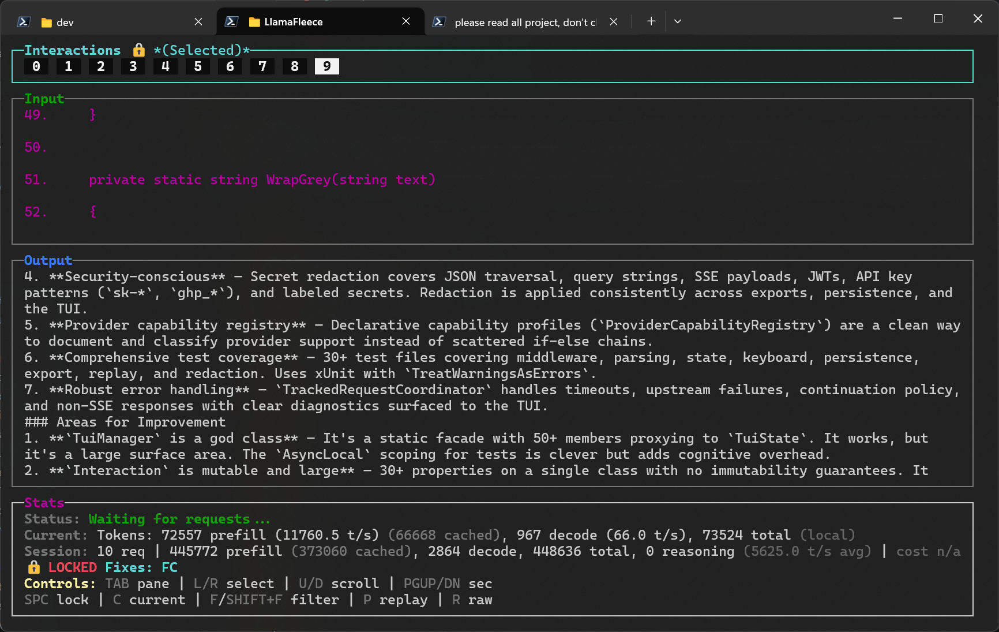
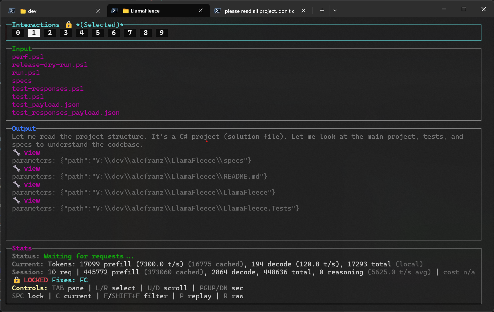
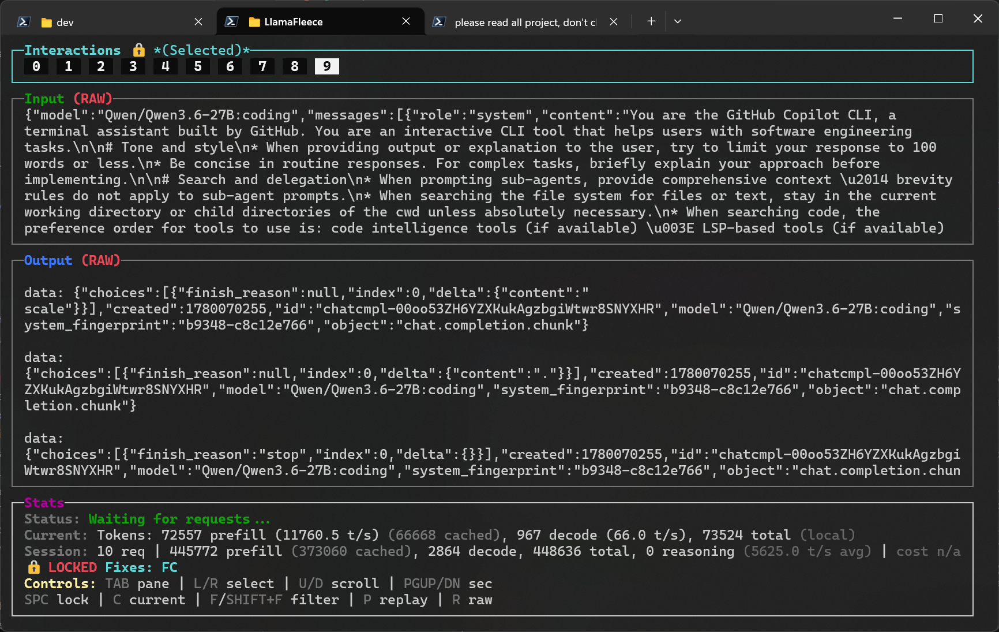
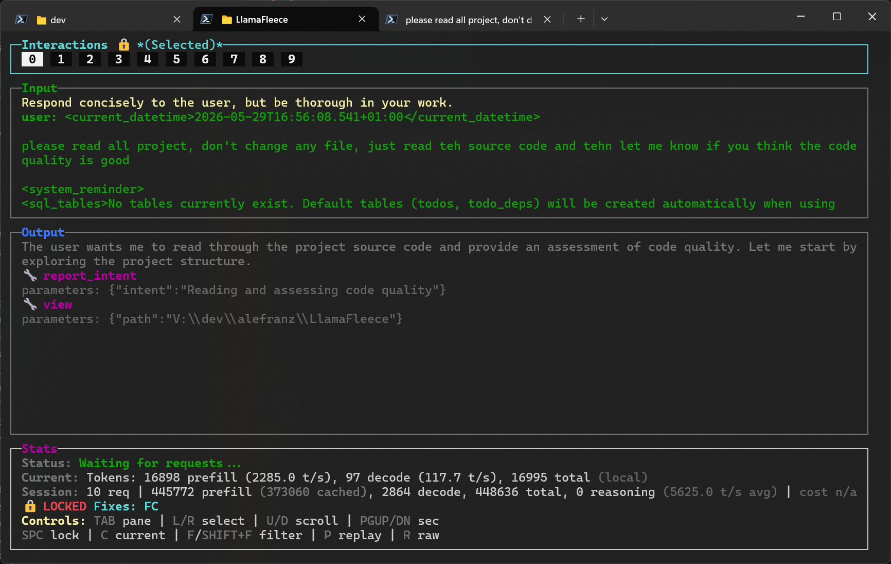

# Screenshots

These are real captures of the current terminal UI, not illustrative mockups.

## Focused interaction

This view shows the main four-pane layout with a selected interaction, projected output, and live session totals.

## Interaction browsing

This capture shows moving across tracked interactions while inspecting both the prompt and the streamed result.

## Raw mode

Raw mode exposes the unprojected request and response payloads when you need to inspect the exact traffic.

## Early session view

This is a simpler live capture from the start of a session while the interaction list is still small.